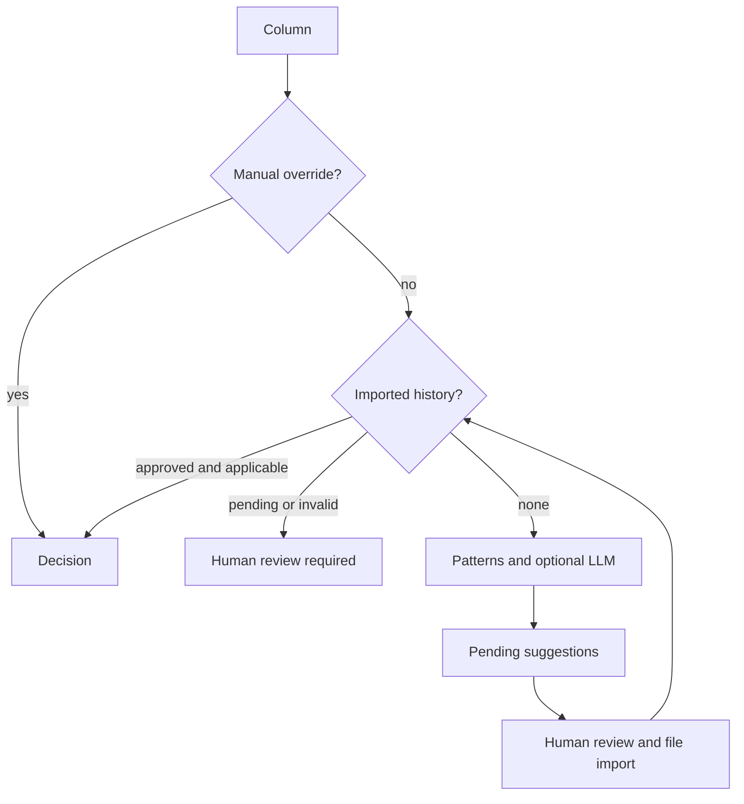

# dbmask

[](https://github.com/sealandseacat/dbmask/actions/workflows/ci.yml)
[](https://pypi.org/project/dbmask/)
[](https://pypi.org/project/dbmask/)
[](LICENSE)
[](https://doi.org/10.5281/zenodo.22083802)
[](https://www.bestpractices.dev/projects/14225)

**Discover which columns hold sensitive data, mask them with realistic
deterministic fakes, then verify the masking actually happened — one
auditable workflow for making safe copies of SQL databases.**

```bash
pip install dbmask
```

Production data constantly leaks into places with weaker controls: dev and
test systems, demo environments, analytics warehouses, vendor handoffs, AI
pipelines. `dbmask` is for the moment you copy that data: it finds the
sensitive columns, rewrites them with consistent fakes, and then **checks its
own work** row by row.

---

## 60-second tour

Everything below runs locally against a throwaway SQLite file (bash syntax;
use your own database URL for the real thing).

```bash
# 0. A demo database
python -c "
import sqlite3
db = sqlite3.connect('demo.db')
db.executescript('''
CREATE TABLE customers (id INTEGER PRIMARY KEY, full_name TEXT, email TEXT);
INSERT INTO customers (full_name, email) VALUES
  ('Mary Johnson', 'mary.johnson@corp.example'),
  ('Robert Smith', 'robert.smith@corp.example'),
  ('Linda Davis',  'linda.davis@corp.example');
'''); db.commit()"

# 1. A minimal config
cat > dbmask.yaml <<'EOF'
database:
  url: sqlite:///demo.db
source_database:
  url: sqlite:///demo_original.db   # untouched copy, used by `validate`
detection:
  skip_column_patterns: ["^id$"]    # surrogate keys aren't sensitive
masking:
  seed: pick-a-private-seed
EOF

# 2. Which columns are sensitive? (read-only)
dbmask scan --config dbmask.yaml
#   [ok       ] main.customers.id (skip, conf=1.00)
#   [SENSITIVE] main.customers.full_name -> full_name (pattern, conf=0.90)
#   [SENSITIVE] main.customers.email -> email (pattern, conf=1.00)

# 3. Preview the changes (dry run; originals are shown redacted)
dbmask mask --config dbmask.yaml

# 4. Keep an untouched copy, then actually mask
cp demo.db demo_original.db
dbmask mask --config dbmask.yaml --apply

# 5. Prove it worked: row counts, schema, and per-row value comparison
dbmask validate --config dbmask.yaml --strict
#   RESULT: PASSED ✓
```

Prefer code over a shell? `python examples/quickstart.py` runs the same story
end-to-end, and the [library API](https://github.com/sealandseacat/dbmask/blob/main/examples/quickstart.py)
mirrors the CLI.

---

## Safe by default

These are behaviors, not aspirations — each one has a regression test:

- **`mask` never writes without `--apply`.** The flag is the single source of
  truth; a config file cannot turn a preview into a write.
- **An incomplete scan aborts masking.** If any column could not be analyzed,
  `mask` refuses to run (exit 2) rather than silently leaving that column
  unmasked. `--allow-partial` is the explicit escape hatch.
- **"Could not tell" is not "not sensitive."** Inconclusive columns are
  reported as `UNKNOWN`, are never masked, never persisted, and both `scan`
  and `mask` tell you to review them.
- **Unmaskable columns are announced.** A sensitive column that is also the
  primary key cannot be rewritten in place — you get a loud `NOT MASKED`
  warning instead of a preview that pretends otherwise.
- **Previews don't leak.** Original values are redacted (`***-**`) in output
  by default (`--show-values` to reveal), dry runs have no side effects, and
  validation reports carry shape-redacted samples only.
- **Verification is a real gate.** `validate` exits non-zero on failure;
  `--strict` also fails on anything it could not verify.

---

## How a decision is made

For each column, manual overrides take precedence. Historical decisions are
reused only after review and while their type, expiry and strategy remain
applicable. Machine suggestions stay pending until an analyst imports a
reviewed file.



- **Overrides** (`config/dbmask.fields.yaml`): a human decision always wins.
- **History**: exact database/schema/table/column records, separate analyst and
  reviewer IDs, explicit masking strategies, expiry/type checks and revisions.
  Import/export CSV, XLSX (`pip install "dbmask[excel]"`), or a strict Markdown
  table. Set `history.source_file` to keep that original file authoritative;
  `history-writeback` merges human-approved review rows back into it with a
  backup and conflict checks. See [the history workflow](docs/history.md).
- **Patterns**: explicit format checks plus column-name and database-type
  context, with no weighted winner selection. Defaults: at least 20 nonblank
  samples and a match ratio of at least 90%. Reports show counts and ratios
  for the SQL connector's **distinct-value samples**, not whole-column row
  percentages. Conflicts and ambiguous identifiers need review. See
  [pattern detection](docs/detection.md) for supported formats and migration.
- **LLM (optional, off by default)**: for the long tail. Works with OpenAI or
  an OpenAI-compatible endpoint — or a **fully local** model (Ollama, LM
  Studio, vLLM), so nothing leaves your network. `llm.send_values: false`
  restricts even a remote provider to column names only. The CLI warns
  explicitly before any values would leave the machine.

## Masking strategies

Deterministic by construction: the same input always maps to the same output
(seeded from `masking.seed`), so `Tesla` masks identically in every table and
joins survive.

| Strategy | Output | Valid for its type? |
|---|---|---|
| `fake_name` / `fake_first_name` / `fake_last_name` | consistent fake from bundled dictionaries | text |
| `fake_city` | another real US city | text |
| `fake_email` | `first.last123@example.invalid` — reserved TLD, can never deliver | ✓ |
| `fake_email_keep_domain` | same, but keeps the original domain (identifiable — opt-in) | ✓ |
| `fake_uuid` | a real, deterministic **v4 UUID** | ✓ |
| `fake_ip` | valid IPv4 octets / IPv6 hex, grouping kept | ✓ |
| `fake_phone` / `fake_ssn` | constrained phone/SSN formats, separators kept | ✓ |
| `fake_credit_card` | same brand/length, separators kept, **Luhn-valid** | ✓ |
| `fake_date` | ±30–730-day deterministic shift — always a real calendar date | ✓ |
| `format_random` | same length & character classes (`Ab3-9z` → `Qf7-2k`) | typed values stay typed |
| `shuffle` | characters permuted in place | typed values stay typed |
| `redact` | `****`, separators kept | text |
| `null` / `blank` | SQL `NULL` / empty string | ✓ |

Typed Python values (int, float, Decimal, date, datetime, UUID, bool) come
back **as their own type and valid for it** — a masked `DATE` column never
receives `8342-73-51`. Register your own with `register_strategy(...)` and
`register_dictionary(...)`.

**Which strategy applies?** Per-column override → your rule mapping →
built-in default for the detected rule → `masking.default_strategy`. Long
free-text fields (notes, comments) are exactly where you should decide
yourself — `blank`, `redact`, or `format_random`:

```yaml
masking:
  column_strategies:
    notes: blank                 # used when no reviewed history strategy is set
  rule_strategies:
    email: fake_email            # per detected rule
  default_strategy: format_random
```

## Consistency — the seed map

Determinism alone drifts: reorder a dictionary file, or change the seed, and
every recomputed mapping silently changes. The **seed map** (on by default)
writes each `original → masked` pair down the first time it is used — keyed
by a salted hash, **never the original value** — and reuses it forever after.
Last month's masked snapshot and today's agree; joins across databases stay
intact.

```yaml
masking:
  seed_map:
    enabled: true
    url:                    # blank = sqlite:///dbmask_seedmap.db
    salt: ${DBMASK_SEED_SALT}   # keep the salt out of the store (recommended)
```

Details, threat model, and the pair-tracking CLI (`dbmask seeds`):
[docs/seed-map](https://sealandseacat.github.io/dbmask/seed-map/).

## Validation — check the work

`dbmask validate` compares the masked database against the untouched source
and exits non-zero for CI gates:

| Check | What it proves |
|---|---|
| Row counts | masking changed values — never added or dropped rows |
| Schema elements | columns/types, PK, indexes, FKs, constraints all match |
| Masking completeness | per-row: no sensitive value survived unchanged |

Completeness is **primary-key aligned**: source and target rows are matched
key-by-key and the sensitive column compared value-by-value, which catches a
row where one field survived unmasked even though others changed. Tables
without a usable key fall back to a documented heuristic whose clean result
is a *warning*, not a pass — `--strict` turns any "could not verify" into a
failure. Reports state their coverage explicitly.

## Supported databases

The connector is a single SQLAlchemy code path, so PostgreSQL, MySQL/MariaDB,
SQL Server, Oracle, SQLite and anything else with a SQLAlchemy dialect are
*wired up* (`pip install "dbmask[postgres]"` etc.).

Honesty about testing: the automated suite currently exercises **SQLite** on
CPython 3.9–3.14 (Linux + Windows). PostgreSQL and MySQL integration tests
are the next roadmap item — until they land, treat those engines as
"supported by construction, verified by early adopters", and please
[report](https://github.com/sealandseacat/dbmask/issues) anything that
misbehaves.

## Security model & limitations

Masking reduces exposure; it is **not** anonymization, and dbmask does not
pretend otherwise:

- **Deterministic masking is dictionary-attackable for guessable values.**
  Anyone holding your `masking.seed` (or the default — the CLI warns) can
  recompute the mapping for values they can guess. Choose a private seed,
  and set the seed-map salt from the environment.
- **Column-level scope.** Mixed PII inside free text is flagged at the column
  level at best; the right treatment for `notes` is usually `blank`/`redact`,
  not clever faking.
- **Primary-key columns are not masked** (announced loudly). Restructure or
  drop such tables before sharing if the key itself is sensitive.
- **Detection is heuristic.** Patterns miss things; review `UNKNOWN` columns,
  keep overrides for what matters, and treat `validate --strict` as the gate.
- Run against a **copy** of production. Never point `--apply` at the primary.

Found a hole in any of these guarantees? That's a security report:
[SECURITY.md](SECURITY.md).

## How dbmask compares

Different tools solve adjacent problems — this table is about *workflow
shape*, not maturity (several of these are excellent and far more
battle-tested):

| Tool | Shape | Where dbmask differs |
|---|---|---|
| [Presidio](https://github.com/microsoft/presidio) | PII detection/de-id framework (text, images) | dbmask is an end-to-end *database* workflow: discover → mask → validate on live connections |
| [Greenmask](https://github.com/GreenmaskIO/greenmask) | PostgreSQL dump anonymizer (Go) | cross-engine via SQLAlchemy; live DBs, not dumps; built-in discovery & validation |
| [pynonymizer](https://github.com/rwnx/pynonymizer) | dump anonymizer, hand-written column list | dbmask discovers columns and verifies the result |
| [PostgreSQL Anonymizer](https://gitlab.com/dalibo/postgresql_anonymizer) | in-database extension (PG only) | no extension install needed; works where you only have a connection string, and across engines |
| Tonic / Gretel | commercial platforms | open source, pip-installable, config-in-git |

If you need heavy-duty subsetting, synthesis, or enterprise scale today,
those tools may serve you better — dbmask optimizes for *one auditable
pipeline you can read in an afternoon*.

## Configuration

Two YAML files (copy the `*.example.yaml` from [`config/`](config), drop the
`.example`): the main config (connection, detection, masking, validation —
secrets via `${ENV_VAR}`) and the field-override file (your manual
sensitive/safe toggles). Every option is commented in the examples;
full reference: [docs/configuration](https://sealandseacat.github.io/dbmask/configuration/).

## Project status & roadmap

`0.1.x` — young and moving fast. The current release focused on making the
safety envelope real (fail-closed scanning, PK-aligned verification, valid
typed output, no PII in previews/logs — see the
[changelog](CHANGELOG.md)). Near-term roadmap:

- PostgreSQL & MySQL integration tests in CI (testcontainers)
- A public detection benchmark (precision/recall per rule, fixed datasets)
- Run manifests: idempotency, resume, and "what exactly did this run touch"
- A small, stable public Python API (`scan / apply / verify`) with a
  deprecation policy
- Governance export (OpenMetadata / DataHub) so classifications feed the
  catalogs organizations already run

Using dbmask anywhere real? Add yourself to [ADOPTERS.md](ADOPTERS.md) or
file [adopter feedback](https://github.com/sealandseacat/dbmask/issues/new?template=adopter_feedback.yml)
— including "we chose something else because…". It steers the roadmap.

## Contributing & development

```bash
git clone https://github.com/sealandseacat/dbmask.git
cd dbmask
python -m venv .venv && source .venv/bin/activate
pip install -e ".[dev]"
pytest
```

Every bug fix ships with a regression test that fails on the old code — the
[test suite](tests) doubles as documented history of every sharp edge found
so far. See [CONTRIBUTING.md](CONTRIBUTING.md).

## Citing

If dbmask is useful in your work, cite it via the repository's
[CITATION.cff](CITATION.cff) (GitHub's "Cite this repository" button).

## License

[MIT](LICENSE)
