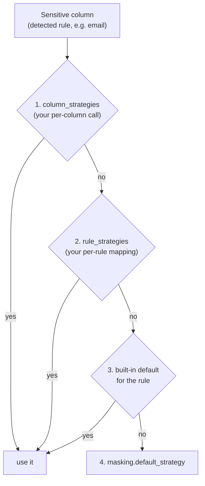

# Masking strategies

A **strategy** is *how* a sensitive value gets transformed. All built-in
strategies are **deterministic**: the RNG is seeded from
`sha256(masking.seed + value)`, so the same input always maps to the same
output — across columns, tables, databases and runs. (The
[seed map](seed-map.md) then makes that durable even when inputs to the
computation change.)

## Catalogue

| Strategy | Output | Notes |
|---|---|---|
| `fake_name` | `Mary Johnson` → `Susan Scott` | consistent first+last from bundled dictionaries |
| `fake_first_name` / `fake_last_name` | single name part | |
| `fake_city` | `Austin` → `Tucson` | US city list bundled; register your own for other locales |
| `fake_email` | `jane@corp.com` → `karen.lopez316@example.invalid` | RFC-reserved `.invalid` TLD — can never actually deliver |
| `fake_email_keep_domain` | `jane@corp.com` → `karen.lopez316@corp.com` | keeps the (possibly identifying) domain — explicit opt-in |
| `fake_uuid` | valid, deterministic **v4 UUID** | case and `{}` braces preserved; `uuid.UUID` in → `uuid.UUID` out |
| `fake_ip` | `203.0.113.7` → `141.66.203.9` | valid octets (1–254); IPv6 keeps grouping/case |
| `fake_phone` | NANP NXX-NXX-XXXX | country prefix, separators and extension shape preserved |
| `fake_ssn` | full or partially hidden SSN shape | consistent space/hyphen/compact forms; visible last four always change; hidden markers stay hidden |
| `fake_credit_card` | same recognized brand and length | separators kept and **Luhn-valid**; original BIN is not retained |
| `fake_date` | ±30–730-day deterministic shift | always a real calendar date, same representation in/out |
| `format_random` | `Ab3-9z` → `Qf7-2k` | same length + character classes; typed values stay typed (below) |
| `shuffle` | characters permuted in place | separators keep positions; typed values dispatch like `format_random` |
| `redact` | `Ada-99` → `***-**` | keeps length/separators |
| `null` / `blank` | SQL `NULL` / `''` | for fields that shouldn't survive at all |

### Typed values stay typed — and valid

Values arrive from the driver as Python objects, not strings. `format_random`
and `shuffle` route them to type-preserving logic:

| Input type | Behavior |
|---|---|
| `int` | digits randomized, digit count kept, no leading zero, sign kept |
| `float` / `Decimal` | digits randomized in place — still parses (`1e-05` keeps its `e`) |
| `date` / `datetime` | delegated to `fake_date` (a real date, same type) |
| `uuid.UUID` | delegated to `fake_uuid` (a `uuid.UUID`) |
| `bool` | passed through — one bit has no shape to hide |

This is what keeps a masked `DATE` column from receiving `"8342-73-51"` and a
masked `INTEGER` column from receiving a string.

## Which strategy applies to a column?

An explicit reviewed `masking_strategy` wins first. Otherwise, first match wins:



Built-in rule defaults: `email→fake_email`, `full_name→fake_name`,
`first_name`/`last_name`/`city` → their fakes, `uuid→fake_uuid`,
`ip_address→fake_ip`, `credit_card→fake_credit_card`,
`date`/`date_of_birth→fake_date`, `phone→fake_phone`, `ssn→fake_ssn`,
`zip_code→format_random`,
`address→redact`.

### Free text is your call

Long text fields (`notes`, `comments`, support transcripts) can contain
*anything*. Detection flags the column at best — the safe treatments are
blunt ones, chosen explicitly:

```yaml
masking:
  column_strategies:
    notes: blank          # wipe it
    # notes: redact       # keep length, hide content
    # notes: format_random  # scramble it
```

## Custom strategies and dictionaries

```python
from dbmask.masking.rules import register_strategy
from dbmask.masking.dictionaries import register_dictionary
from dbmask.masking.format import seeded_rng

register_dictionary("countries", ["France", "Japan", "Brazil"])

def strat_fixed_suffix(value, ctx):
    if value is None:
        return None                      # masking never invents data
    rng = seeded_rng(str(value), ctx.seed)
    return f"user-{rng.randint(1000, 9999)}"

register_strategy("fixed_suffix", strat_fixed_suffix)
```

Rules for a well-behaved strategy: deterministic (derive randomness from
`seeded_rng(value, ctx.seed)`), `None` stays `None`, and output should be
valid for the column's type. `dbmask strategies` lists everything registered.

## Format contracts and migration

The default for a `full_name` detection uses `fake_first_name` for columns such
as `first_name`/`given_name`/`middle_name` and `fake_last_name` for
`last_name`/`family_name`/`surname`. Explicit reviewed, column and rule mappings
still take precedence. Remove a broad `full_name: fake_name` mapping if you
want the column-aware default.

`fake_phone`, `fake_ssn`, `fake_credit_card` and `fake_date` reject unsupported
nonempty input with `MaskingValidationError`, without including the value in
the error. A 90% sample match does not validate the remaining database rows.
Use an exact-column `masking.null_placeholders` policy for reviewed missing-value
markers such as `"NULL"` or `"-"`; only those cells become SQL NULL and valid
values still receive the chosen strategy. Unsupported non-marker values still
raise. The column must allow NULL. This policy avoids selecting a whole-column
`null` strategy merely because a few cells contain placeholders. Other invalid
values require data correction or an explicitly reviewed alternative strategy.
Missing values stay missing in the strict strategies.
Dictionary replacements avoid selecting the original; the engine also rejects
unchanged replacements (including cached ones and case-only changes). For
example, `shuffle` cannot mask `AAAA`, and a sensitive boolean needs an explicit
strategy such as `null` if its column permits it.

Format-valid generated phone/SSN/card values are not guaranteed unassigned.
They are synthetic replacements, not encryption or payment tokens. This patch
does not guarantee unique replacements or preservation of all business rules.

Phone/SSN defaults now use new strategies, so old `format_random` mappings are
not reused. Cards use a new `fake_credit_card:brand-v2` seed-map namespace;
previous card entries stay stored but are bypassed. Explicit historical
strategies remain authoritative: review old `format_random` choices if you
want these stronger format contracts. Rebuild related test copies together
when changing strategies; do not mix old and new mappings across joins.

Issue #36 extends `fake_ssn` to consistent space-separated forms and partial
values such as `XXX-XX-5109`, `xxx xx 5109`, `***-**-5109` and `XXXXX5109`.
Hidden markers remain hidden; the visible serial changes to another nonzero
four-digit value. Full SSNs also always change the serial. Hidden groups are
not reconstructed or claimed valid. Invalid full groups, inconsistent separators,
zero serials and unsupported partial shapes still raise.

SSN pairs now use `fake_ssn:format-v2`, bypassing earlier cached outputs that
could retain the same last four digits. Older rows remain in the seed store.
Rebuild related masked copies together after upgrading. Newly supported English
month dates use the shared parser; existing numeric-date mappings keep their
`calendar-v2` scope. See [supported date layouts](detection.md#dates-and-masking).

A runnable [mixed-format example](issue36-demo.md) creates before/after CSVs
without replacing valid date, phone, SSN, IP or card values with NULL.

Always preview and apply to a disposable copy. Masking commits in batches;
if a later row fails validation, earlier batches may already have changed.
The error is not a database-wide rollback. Restart from an untouched copy
after fixing the strategy or data. Review exports record the strategy actually
selected by the engine, including configured overrides.
